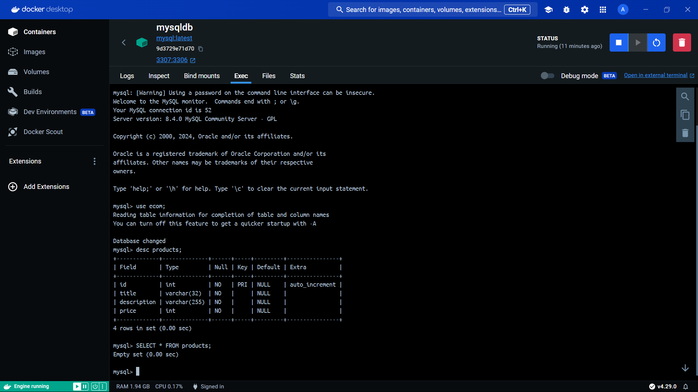

<h1 align='center'>Node.js Express REST API with MySQL Database in Docker</h1>
This project is a RESTful API built using Node.js and Express.js, with MySQL as the database management system running in Docker containers. It provides endpoints for performing CRUD operations (Create, Read, Update, Delete) on resources stored in the MySQL database.

<h3>Features</h3>

- CRUD Operations: Perform Create, Read, Update, and Delete operations on resources via API endpoints.
- Express.js Middleware: Implement middleware for handling request logging, error handling, and more.
- Dockerized MySQL Database: Utilize Docker to run a MySQL container for database management.
- Scalable Architecture: Built using the popular Node.js and Express.js frameworks, ensuring scalability and maintainability.

<h3>Technologies Used</h3>

- Node.js: JavaScript runtime for building server-side applications.
- Express.js: Web application framework for Node.js, providing a robust set of features for building RESTful APIs.
- MySQL: Relational database management system used for storing and retrieving data. Used the [mysql2](https://www.npmjs.com/package/mysql2) node package. 
- Docker: Containerization platform used to run [MySQL](https://hub.docker.com/_/mysql) in isolated environments. 
- npm: Package manager for Node.js used for installing dependencies and managing scripts.
- dotenv: Module used for loading environment variables from a .env file.

 

<h3 align='center'>Initialized mysql table inside Docker</h3>
